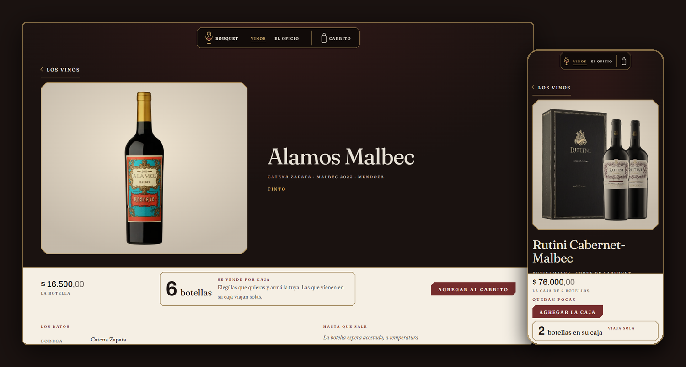
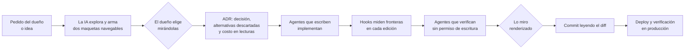
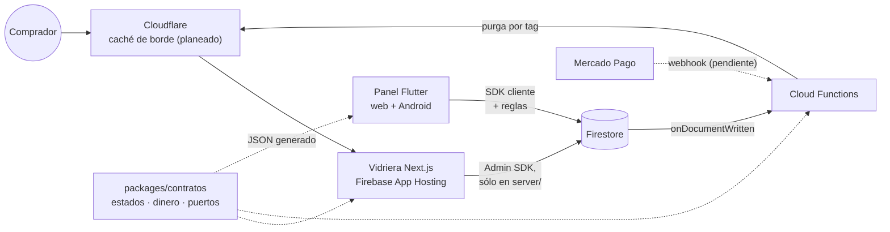
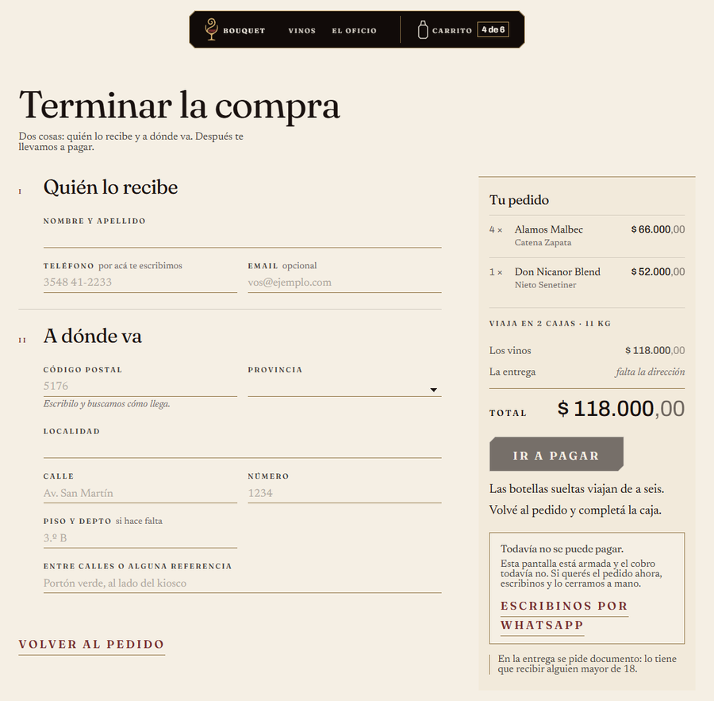

<p align="center">
  
</p>

<h1 align="center">bouquet</h1>

<p align="center">
  La tienda de vinos online de un cliente, hecha con IA como equipo y con las decisiones técnicas a mi cargo.<br>
  <sub>Next.js · React · Flutter · Firebase · TypeScript · Claude Code</sub>
</p>

<p align="center">
  <a href="https://github.com/aguschazaaa-sudo/bouquet/actions/workflows/ci.yml"></a>
</p>



> **Estado, septiembre de 2026.** La vidriera funciona completa hasta el botón
> de pagar, con datos de prueba. **Todavía no cobra ni está publicada, a
> propósito:** hay controles que frenan la publicación y se pueden verificar
> desde afuera con `curl` ([detalle abajo](#qué-funciona-y-qué-falta)).

---

## De qué se trata

**bouquet** es la tienda de vinos online de un cliente, en Argentina. Tiene
tres partes: una **vidriera** pública en Next.js, un **panel** de
administración en Flutter y un **backend** en Firebase.

Pero este repo muestra, más que la tienda, **cómo trabajo**. Casi todo el
código lo escribe Claude Code. Para poder confiar en eso armé un sistema con
tres roles bien separados:

- **El dueño**, mi cliente, decide qué se vende, cómo se vende y cómo se ve.
- **Yo** decido la arquitectura, el proceso, los límites de la IA y qué llega a
  producción.
- **La IA** propone, implementa y mide, y cada cosa se comprueba antes de darla
  por buena.

El proyecto arrancó el 1 de septiembre de 2026 sobre las lecciones de mi
proyecto anterior, **PadelPunilla** (Flutter + Firebase, en producción con
clientes reales). Antes de escribir una línea de código, convertí sus
post-mortems en [reglas para este repo](LECCIONES.md).

## Cómo trabajo



Tres principios sostienen todo el sistema:

1. **Si una regla no está en un hook, no se cumple.** Un prompt describe lo que
   quiero; un hook mide lo que pasó. Los límites de la arquitectura los hacen
   cumplir scripts, no instrucciones.
2. **Un verde no prueba nada.** Ni un job verde, ni un `HTTP 200`, ni un
   `Deploy: success`. Cada verificación lleva un control positivo (algo que
   *tiene* que aparecer) y uno negativo (una ruta inventada *tiene* que dar 404).
3. **El sistema produce lo que dice el último paso del proceso.** Si el proceso
   termina en "commit", salen commits sin deploy. Por eso el checklist de
   [CLAUDE.md](CLAUDE.md) termina en *verificar producción y decir cómo*.

## Quién decide qué

| Decisión | Quién | Un caso real |
|---|---|---|
| **Reglas del negocio** | El dueño | El vino suelto se vende de a 6, y lo que viene en su propia caja viaja solo y no suma para las seis ([ADR 009](docs/vault/architecture/decisions/009-venta-por-caja.md)). No hay retiro en el local ni descuento por caja ([ADR 010](docs/vault/architecture/decisions/010-el-checkout.md)). |
| **Plataforma** | Yo, con evidencia que mide la IA | Next.js para la vidriera, porque Flutter web dibuja todo en un `<canvas>` y los buscadores no ven nada: lo medí en producción en PadelPunilla ([ADR 001](docs/vault/architecture/decisions/001-stack.md)). El dueño prefirió Firebase a Vercel, y la IA resolvió cómo conseguir en Firebase lo que daba Vercel ([ADR 005](docs/vault/architecture/decisions/005-hosting-vidriera.md)). |
| **Diseño visual** | El dueño, entre maquetas que arma la IA | La IA arma dos maquetas navegables con datos reales y el dueño elige mirándolas: *mostrador* para el catálogo y *el remito* para el checkout ([ADR 008](docs/vault/architecture/decisions/008-catalogo-stock-y-carrito.md), [ADR 010](docs/vault/architecture/decisions/010-el-checkout.md)). |
| **Diseño técnico** | La IA propone, yo apruebo | Los estados de una orden van en dos ejes, pago y entrega, y no en una sola lista ([ADR 002](docs/vault/architecture/decisions/002-estados-de-orden.md)). Una caja armada no es un producto: es un carrito prearmado. El diseño cambió dos veces, y las versiones descartadas quedaron escritas en el ADR ([ADR 009](docs/vault/architecture/decisions/009-venta-por-caja.md)). |
| **Detalle de implementación** | La IA, dentro de las reglas | Cambió la tipografía de los precios porque la anterior no tenía cifras de ancho fijo, y bajó un filete dorado del 80 % al 72 % para llegar al contraste de WCAG ([tokens](docs/vault/design/tokens.md)). Decidió que un pago rechazado se pueda reintentar y no deje la orden muerta ([ADR 002](docs/vault/architecture/decisions/002-estados-de-orden.md)). |
| **Verificación** | La IA mide; el dueño y yo miramos | La IA corre builds, `curl` y capturas con controles. Nosotros abrimos la página, y así apareció un efecto parallax que según los números de la IA funcionaba y en pantalla no se veía. |
| **Proceso y límites** | Yo | Ningún hook escribe en git. Nada pesado corre en mi máquina. Antes que código nuevo, una dependencia conocida. Pocos agentes en paralelo. |
| **Producción** | Yo | La tienda no se publica hasta que se cierren sus controles, y nada que cobre sale sin pasar por el agente que revisa pagos. |

## Cómo me apoyo en la IA

### Un contrato escrito: `CLAUDE.md`

[CLAUDE.md](CLAUDE.md) es lo primero que lee la IA en cada sesión: el checklist
obligatorio, lo que no se puede correr en esta máquina, cómo se despliega, cómo
se verifica y qué decisiones no se vuelven a discutir. Cierra con tres errores
que la IA comete si nadie se los marca:

> 1. **Construyo de arriba hacia abajo.** Empezá por el componente hoja.
> 2. **Digo "listo" cuando compila.** Compilar, pasar tests y desplegarse son
>    tres cosas distintas de que alguien lo haya mirado renderizado.
> 3. **Le creo a la documentación.** Si el vault dice "completa", grepeá igual.

### Agentes con permisos reales

En [`.claude/agents/`](.claude/agents/) hay 13 subagentes. Aprendí que el campo
`tools:` restringe **herramientas**, no **carpetas**: un agente con permiso de
edición puede escribir en cualquier parte, diga lo que diga su prompt. Por eso
los que revisan no tienen `Edit` ni `Write`: no pueden escribir aunque quieran.

| Escriben | Verifican (sin permiso de escritura) |
|---|---|
| `contratos` · `functions` · `reglas` | `cazador-de-puertas`: ¿alguien puede abrir lo que escribimos? |
| `tienda` · `admin-datos` · `admin-presentacion` | `presupuesto-lecturas`: ¿cuántas lecturas cuesta, contra la cuota diaria? |
| `vault` · `voz` (sin `Bash`: no pueden desplegar) | `revisor-pagos`: obligatorio en todo lo que toca plata |
| | `auditor-produccion`: ¿qué está corriendo de verdad? |
| | `revisor-acoplamiento`: una vez por semana, sobre todo el repo |

### Hooks que miden

Los hooks corren en cada edición de la IA y frenan lo que viola una regla:

| Hook | Qué frena |
|---|---|
| `vault-precheck` | Escribir código sin haber leído antes el estado del proyecto |
| `layer-boundary` | Un dominio que importa Firebase, o una pantalla que importa la capa de datos |
| `frontera-features` | Dos features que se importan entre sí, o un `shared/` que depende de una feature |
| `server-only-guard` | `firebase-admin` fuera de `apps/tienda/src/server/` |
| `widget-size-guard` · `one-widget-per-file` | Pantallas de más de 200 líneas, o varios widgets públicos en un archivo |
| `no-hardcoded-colors` | Colores escritos a mano fuera de los tokens |
| `call-site-guard` | *(sólo avisa)* Código que nadie referencia |

Un hook que nadie prueba puede dar verde sin mirar nada. Por eso
[`probar_hooks.sh`](scripts/hooks/probar_hooks.sh) prueba cada regla con un
caso que tiene que bloquear y otro que tiene que pasar.

### La documentación como memoria

- **[ADRs](docs/vault/architecture/decisions/)**: cada decisión con su contexto,
  las alternativas descartadas y por qué. El costo en lecturas de Firestore,
  medido contra la cuota gratuita de 50.000 por día, es un campo obligatorio.
- **[`_index.md`](docs/vault/_index.md)**: el estado del proyecto. Lo que está
  abierto lleva fecha y el evento que lo dispara.
- **[`_verdad.md`](docs/vault/_verdad.md)**: lo **genera un script** a partir
  del código (estados, tests, hooks y permisos), y el CI falla si quedó
  desactualizado. La diferencia entre lo que el código hace y lo que dice
  `_index.md` es la deuda del proyecto, medida. Por eso los conteos de tests
  están ahí y no en este README.
- **[OpenSpec](openspec/)**: cada feature pasa por una especificación antes del
  código. Lo que toca plata tiene su propio workflow, con revisión obligatoria
  ([WORKFLOWS.md](WORKFLOWS.md)).

### Varias miradas a la vez, y maquetas antes que documentos

Para los problemas de diseño abiertos lanzo varios agentes en paralelo, cada
uno con un sesgo declarado (fotografía, narrativa, ingeniería, comercial). Lo
valioso casi nunca es una propuesta suelta, sino **lo que varias comparten y es
falso**: tres de cinco inventaron que el vino venía del Valle de Uco, y la
tienda no produce vino.

Y lo visual se decide mirando: la IA publica maquetas navegables que el dueño
abre en el teléfono, y el documento se escribe después.

## Errores que agarré, y la regla que dejaron

La IA se equivoca de maneras previsibles. Cada vez que agarré un error, lo
convertí en una regla escrita o en un test:

| Qué pasó | Cómo apareció | Qué quedó |
|---|---|---|
| El parallax era fiel a los tokens de diseño, y los tokens estaban mal: el efecto no se veía | Mirando la página, no los números | Medir en la unidad que percibe el usuario, no en la del código |
| Una respuesta 403 se leyó como "no hay reglas publicadas" | Mirando el código de respuesta y no la lista vacía | Una lista vacía por un error de lectura confirma cualquier cosa |
| El control de publicación no distinguía sus dos estados: Next.js serializa `undefined` en el payload de React | Probándolo con la constante en los dos valores | Se reescribió y se verificó en ambos estados |
| `unstable_cache` iba a convertir la home estática en una página que se regenera cada 60 segundos | Midiendo el build | Un test que falla si la home importa la caché |
| Todos los botones tenían triangulitos grises en las esquinas, desde el primer día | Abriendo la captura: a 30 px no se notaba, a 200 sí | Reset del `<button>` en el componente compartido |
| Seis agentes en paralelo agotaron la sesión y cinco no terminaron | La sesión se cortó | Pocos agentes a la vez; si la tarea viene larga, el trabajo se hace en el hilo principal |
| Levantó cuatro procesos de Node para mirar algo que el diff ya probaba | Se me trabó la máquina | Antes de levantar un servidor: ¿qué descarta esto que el diff no descarta? |
| Escribía utilidades propias | Se lo marqué | Primero una dependencia conocida; el código propio, para lo que es del dominio |

## Tecnologías: lo que ya sabía y lo que aprendí acá

| Tecnología | Al empezar | Cómo me desenvolví |
|---|---|---|
| **Flutter · Dart · Riverpod** | **Lo domino.** En producción en PadelPunilla | El panel reusa la arquitectura por capas y los hooks que ya me funcionaban. Y aun así elegí **no** usarlo para la vidriera (ver Next.js). |
| Firebase: Firestore, reglas, Cloud Functions | Lo usé en producción, en PadelPunilla | Llegué con las lecciones escritas: triggers `onDocumentWritten`, idempotencia dentro de la misma transacción y el orden de deploy reglas → functions → front. |
| TypeScript | Lo usé para Cloud Functions, en PadelPunilla y en Colibri | Acá dejó de ser sólo backend: es el lenguaje de la vidriera y del dominio. [`packages/contratos`](packages/contratos/) tiene la máquina de estados, el dinero en centavos y los puertos, testeados con el runner nativo de Node 24 y sin dependencias de test. |
| GitHub Actions | Lo usé en producción, en PadelPunilla | CI con tres alcances para no gastar minutos. Aprendí que `gh run watch` devuelve 0 en una corrida cancelada. |
| **Next.js 16** (App Router, Server Components, Server Actions) | **Nuevo** | Elegí aprenderlo en vez de usar Flutter web, que domino, porque medí que Flutter web es invisible para los buscadores, y una tienda vive de que la encuentren. Cada trampa apareció midiendo sobre `next build` + `next start`, y quedó como test o como regla. |
| **React 19** | **Nuevo** | Llegó con Next.js. Compongo de la pieza más chica a la página, y el acceso a datos queda encerrado en `server/`, con un hook que frena cualquier import de `firebase-admin` fuera de ahí. |
| **Mercado Pago** | **Nuevo**: en PadelPunilla los pagos se postergaron | Investigué y escribí antes de tocar código ([notas](docs/vault/architecture/proveedores/mercado-pago.md)). El cobro está apagado con un control que se verifica desde afuera. Lo que no viví está marcado como ⚠️ **EXTRAPOLADO**. |
| **Firebase App Hosting + Cloudflare** | **Nuevo** | El [ADR 005](docs/vault/architecture/decisions/005-hosting-vidriera.md) razona la purga de caché por tag, y dice explícitamente que todavía no la medí. |
| **Logística (Envíopack)** | **Nuevo** | Una interfaz `ProveedorDeEnvio` con un cotizador simulado que tiene la forma real: el día que llegue el proveedor se cambia la implementación y la pantalla no se entera. |
| **Diseño visual y de marca** | Sólo en mis propios productos | Acá la marca es de un cliente, así que el proceso es más formal: dirección visual, tokens y [guía de voz](docs/vault/design/voz.md) antes del primer componente, contrastes calculados con la fórmula de WCAG y maquetas para que el dueño elija mirando. |

Con lo que no domino repito el mismo patrón: **investigar y escribir antes de
programar, aislar lo externo detrás de una interfaz, apagarlo con un control
que se pueda verificar, y marcar como extrapolado lo que no viví.**

Y una restricción que moldeó decisiones: mi máquina tiene 7,9 GB de RAM. Los
análisis y builds pesados corren en CI, y el paquete de contratos corre
TypeScript con Node 24 sin compilar, sin Jest ni Vitest.

## La arquitectura en una pantalla



Las decisiones que más pesan, cada una con su ADR:

- **La orden tiene dos ejes de estado**, pago y entrega, y sus combinaciones se
  proyectan en estados públicos con un rótulo para el comprador y otro para el
  operador. La tabla completa se [genera desde el código](docs/vault/_verdad.md)
  ([ADR 002](docs/vault/architecture/decisions/002-estados-de-orden.md)).
- **La vidriera no lee Firestore por cada visita.** Renderiza en el servidor y
  la caché de borde se purga por tag cuando cambia un producto
  ([ADR 004](docs/vault/architecture/decisions/004-frescura-y-lecturas.md),
  [ADR 005](docs/vault/architecture/decisions/005-hosting-vidriera.md)).
- **El precio es un entero en centavos**, y la orden guarda una copia del
  producto, no una referencia.
- **El carrito vive en `localStorage`** y el catálogo se filtra en memoria:
  no hay colección de carritos ni índices compuestos
  ([ADR 008](docs/vault/architecture/decisions/008-catalogo-stock-y-carrito.md)).
- **La vidriera se ordena por feature**, con cinco reglas para que `shared/` no
  se vuelva un cajón de sastre, y un hook que mide la que se rompe más fácil
  ([ADR 006](docs/vault/architecture/decisions/006-estructura-de-la-tienda.md)).

```text
apps/tienda/          vidriera Next.js: features/, shared/ y server/
apps/admin/           panel Flutter (por ahora, sólo la base)
functions/            Cloud Functions en TypeScript
packages/contratos/   estados de la orden, dinero y puertos: lo usan los tres
docs/vault/           ADRs, estado del proyecto y _verdad.md generado
openspec/             especificaciones de cada feature
scripts/hooks/        los hooks y sus pruebas
.claude/              agentes, skills y permisos
```

## Qué funciona y qué falta

**Funciona, con datos de prueba:** la home, la sección *El oficio*, el catálogo
con filtros, la ficha de cada vino, el carrito con la regla de la caja y el
checkout, que cotiza el envío con un cotizador simulado. Las reglas de
seguridad de Firestore y Storage están publicadas.

**Falta:** crear la orden y cobrar (Mercado Pago y su webhook), las pantallas
del panel, la verificación de edad, Cloudflare y el dominio.

<p align="center">
  
</p>

El checkout está armado y el botón de pagar está **apagado a propósito**: un
"Pagar" que llega antes que su webhook es una venta que se cobra y no se
registra. El interruptor (`EL_CHECKOUT_NO_COBRA`) también se escribe en el HTML
como atributo, así que se puede auditar en producción con `curl`, no sólo con
`grep` en el repo. Lo mismo pasa con el contacto provisorio de *El oficio*.

## Probarlo

```bash
npm install
npm run tipos                        # TypeScript en los tres paquetes
npm test                             # contratos y tienda, con el runner de Node
bash scripts/hooks/probar_hooks.sh   # que los hooks sigan midiendo
```

La vidriera (`npm run dev -w @bouquet/tienda`) lee el catálogo de un proyecto
de Firebase y necesita credenciales: ver
[`apps/tienda/.env.example`](apps/tienda/.env.example).

## Para leer más

| Documento | Qué cuenta |
|---|---|
| [ARQUITECTURA.md](ARQUITECTURA.md) | La forma del sistema, los estados de la orden y el presupuesto de lecturas |
| [CLAUDE.md](CLAUDE.md) | El contrato con la IA: el checklist, lo prohibido y las decisiones que no se rediscuten |
| [WORKFLOWS.md](WORKFLOWS.md) | Los cinco workflows (feature, cambio menor, exploración, plata y mantenimiento) y quién hace cada paso |
| [SKILLS-AGENTES-MCP.md](SKILLS-AGENTES-MCP.md) | Qué se cumple de verdad y qué es sólo un prompt |
| [LECCIONES.md](LECCIONES.md) | ~37.000 palabras de post-mortems de PadelPunilla, destiladas en reglas |
| [DIAGNOSTICO.md](DIAGNOSTICO.md) | Qué funcionaba y qué no en el proyecto anterior, y qué traer de cada cosa |
| [SETUP-PRIMERA-CORRIDA.md](SETUP-PRIMERA-CORRIDA.md) | Cómo quedó listo el repo antes de la primera línea de código |
| [docs/vault/_index.md](docs/vault/_index.md) | El estado actual, con lo abierto y qué lo destraba |
| [docs/vault/design/voz.md](docs/vault/design/voz.md) | La voz de la marca: *bouquet no hace vino. Lo guarda.* |

---

<p align="center">
  <b>Agustín Chazarreta</b> · <a href="https://www.linkedin.com/in/agustin-chazarreta-3384a519a/">LinkedIn</a> · <a href="https://github.com/aguschazaaa-sudo">GitHub</a>
</p>
